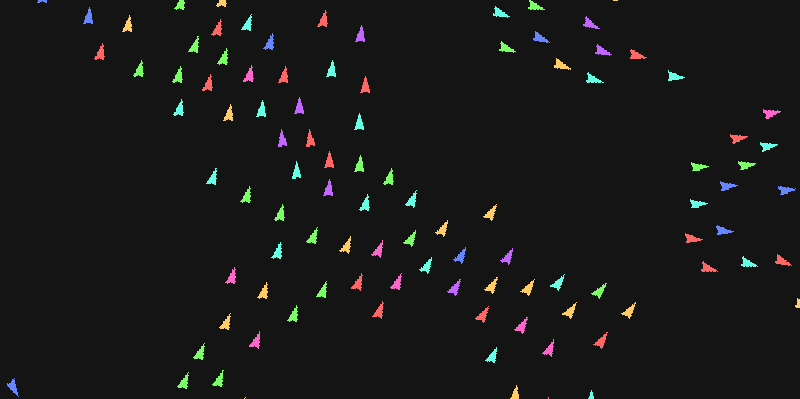

# Boids

## Descritption



A [Boids] simulation written in python.

## Features

- Spatial Hashing
- Adjustable Framerate
- Adjustable speed
- Choose number of Boids

## Requirments

- [Pygame]
- [Numpy]

To install requirements:
```sh
pip install -r requiremnts.txt
```
Or install the modules separetely with
```sh
pip install pygame
```
and
```sh
pip install numpy
```

[Boids]: https://en.wikipedia.org/wiki/Boids
[Pygame]: https://www.pygame.org/wiki/GettingStarted
[Numpy]: https://numpy.org/